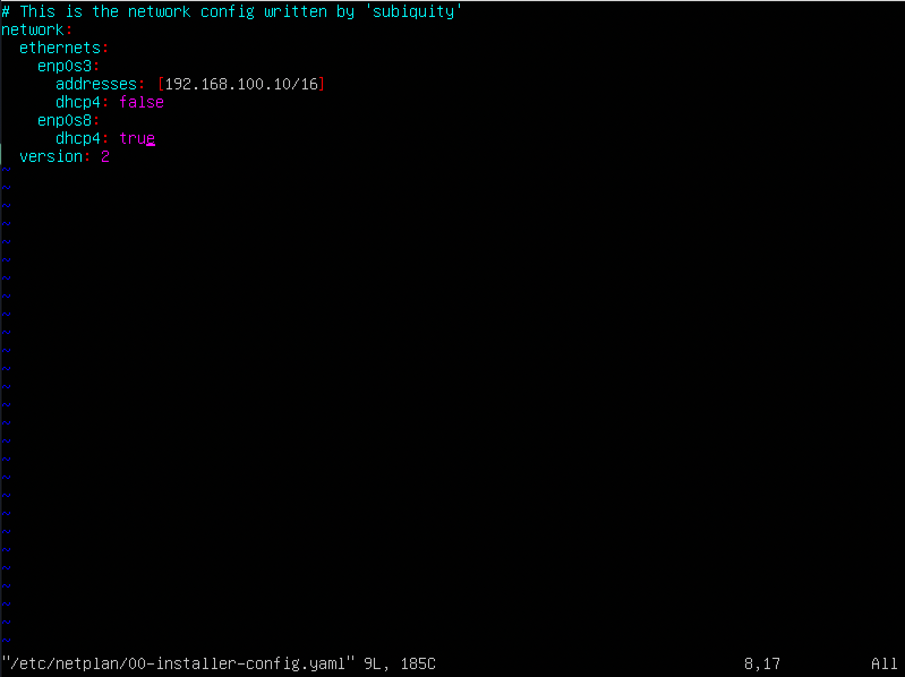
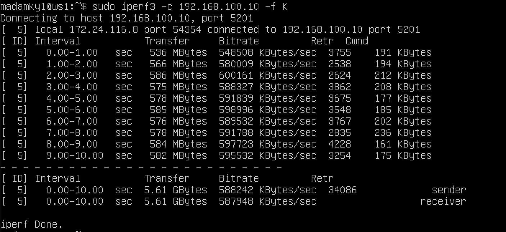
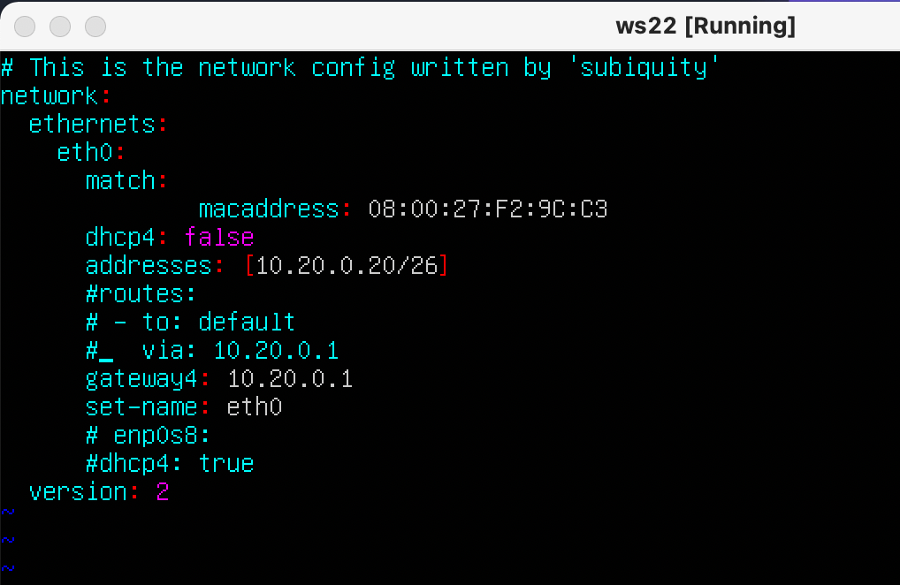

## Part 1
1.  Сети и маски.
    1. Адрес сети 192.167.38.54/13
    * Команда `ipcalc 192.167.38.54/13` 
    
    2. Перевод маски 255.255.255.0 в префиксную и двоичную запись, /15 в обычную и двоичную, 11111111.11111111.11111111.11110000 в обычную и префиксную
    * Префикс маски подсети 255.255.255.0: /24
    * Маска подсети (двоичный вид) 255.255.255.0: 11111111.11111111.11111111.00000000
    * Маска подсети (нормализованный вид) /15: 255.254.0.0
    * Маска подсети (двоичный вид) /15: 11111111.11111110.00000000.00000000
    * Маска подсети (двоичный вид) /15: 11111111.11111110.00000000.00000000
    * Префикс маски подсети 11111111.11111111.11111111.11110000: /28
    * Маска подсети (двоичный вид) 11111111.11111111.11111111.11110000: 255.255.255.240
    3. Минимальный и максимальный хост в сети 12.167.38.4 при масках: /8, 11111111.11111111.00000000.00000000, 255.255.254.0 и /4
    * Минимальный и максимальный с маской /8: 12.0.0.1 и 12.255.255.254
    * Минимальный и максимальный с маской 11111111.11111111.00000000.00000000: 12.167.0.1 и 12.167.255.254
    * Минимальный и максимальный с маской 255.255.254.0: 12.167.38.1 и 12.167.39.254
    * Минимальный и максимальный с маской /4: 0.0.0.1 и 15.255.255.254

2.  localhost
    1. Определить и записать в отчёт, можно ли обратиться к приложению, работающему на localhost, со следующими IP: 
    * 194.34.23.100 - нельзя обратиться,
    * 127.0.0.2 - 127.0.0.1 - диапазон IP-адресов, которые предназначены для создания локальных сетей 127.255.255.255,
    * 127.1.0.1 - диапазон IP-адресов, которые предназначены для создания локальных сетей 127.255.255.255,
    * 128.0.0.1 - нельзя обратиться

3.  Диапазоны и сегменты сетей
    1. какие из перечисленных IP можно использовать в качестве публичного, а какие только в качестве частных: 10.0.0.45, 134.43.0.2, 192.168.4.2, 172.20.250.4, 172.0.2.1, 192.172.0.1, 172.68.0.2, 172.16.255.255, 10.10.10.10, 192.169.168.1
    * 10.0.0.0 — 10.255.255.255 (маска подсети для бесклассовой (CIDR) адресации: 255.0.0.0 или /8)
    * 100.64.0.0 — 100.127.255.255 (маска подсети 255.192.0.0 или /10) - Данная подсеть рекомендована согласно RFC 6598 для использования в качестве адресов для CGN (Carrier-Grade NAT).
    * 172.16.0.0 — 172.31.255.255 (маска подсети: 255.240.0.0 или /12)
    * 192.168.0.0 — 192.168.255.255 (маска подсети: 255.255.0.0 или /16)
    * Публичные IP - 134.43.0.2, 172.0.2.1,172.68.0.2, 192.169.168.1
    * Частные IP - 10.0.0.45, 192.168.4.2, 172.20.250.4, 192.172.0.1, 172.16.255.255, 10.10.10.10
    2. какие из перечисленных IP адресов шлюза возможны у сети 10.10.0.0/18: 10.0.0.1, 10.10.0.2, 10.10.10.10, 10.10.100.1, 10.10.1.255
    * IP адресы 10.10.0.2

___
## Part 2
1. С помощью команды ip a посмотреть существующие сетевые интерфейсы
* Команда `ip a` 
* Первая машина

* Вторая машина

2. Описать сетевой интерфейс, соответствующий внутренней сети, на обеих машинах и задать следующие адреса и маски: ws1 - 192.168.100.10, маска /16, ws2 - 172.24.116.8, маска /12
* На уровне сетевого интерфейса TCP/IP создает из IP-дейтаграмм пакеты, которые могут интерпретироваться и передаваться с помощью определенных сетевых технологий.
Сетевой интерфейс - это программное обеспечение, взаимодействующее с сетевым драйвером и с уровнем IP. Сетевой интерфейс обеспечивает уровню IP доступ ко всем имеющимся сетевым адаптерам.
Программное обеспечение уровня IP выбирает сетевой интерфейс в соответствии с целевым адресом передаваемого пакета. Каждый сетевой интерфейс имеет свой сетевой адрес. Уровень сетевого интерфейса отвечает за добавление и удаление заголовков протокола уровня передачи, необходимых для доставки сообщения в пункт назначения. Драйвер сетевого адаптера управляет картой сетевого адаптера.
Сетевой интерфейс обычно связан с сетевым адаптером, хотя это и не всегда так. Например, циклический интерфейс не связан с картой адаптера. В системе должны быть установлены карты сетевых адаптеров для каждой сети, к которой она подключена (даже если это сети одного типа). Однако для работы со всеми сетевыми адаптерами нужен только один экземпляр программного обеспечения сетевого интерфейса. Например, если система подключена к двум сетям Token-Ring, то в ней должно быть установлено две карты сетевого адаптера. При этом требуется только один экземпляр программного обеспечения сетевого интерфейса token-ring и один экземпляр драйвера Token-Ring. 
* Первая машина

* Вторая машина

3. Выполнить команду netplan apply для перезапуска сервиса сети
* Команда `netplan apply` первая машина

* Вторая машина

1.  Добавление статического маршрута вручную
    1. Добавить статический маршрут от одной машины до другой и обратно при помощи команды вида ip r add
    * Командой `ip r` узнаем ip подсеть и ip машины
    * Команда `sudo ip r add "ip подсеть(ws2)" via "ip машины(ws1)"`
    2. Пропинговать соединение между машинами
    * Командой `ping ip машины(ws2)`
    * Первая машина
    
    * Вторая машина
    

2.  Добавление статического маршрута с сохранением
    1. Перезапустить машины
    2. Добавить статический маршрут от одной машины до другой с помощью файла etc/netplan/00-installer-config.yaml
    * Командой `sudo vim etc/netplan/00-installer-config.yaml` 
    * Первая машина
    
    * Вторая машина
    
    3. Пропинговать соединение между машинами
    * Командой `ping 8.8.8.8` 
    * Первая машина
    
    * Вторая машина
    

___
## Part 3
1.  Скорость соединения
    1. Перевести и записать в отчёт: 8 Mbps в MB/s, 100 MB/s в Kbps, 1 Gbps в Mbps
    * 8 Mbps - 1 MB/s
    * 100 MB/s - 100000 Kbps
    * 1 Gbps - 1000 Mbps

2.  Утилита iperf3
    1. Измерить скорость соединения между ws1 и ws2
    * Команда для первой машины `iperf3 -s -f K` 
    
    * Команда для первой машины `iperf3 -c 192.168.100.10 -f K`  
    

___
## Part 4
1.  Утилита iptables. Создать файл /etc/firewall.sh, имитирующий фаерволл, на ws1 и ws2
    1. на ws1 применить стратегию когда в начале пишется запрещающее правило, а в конце пишется разрешающее правило (это касается пунктов 4 и 5)
    2. на ws2 применить стратегию когда в начале пишется разрешающее правило, а в конце пишется запрещающее правило (это касается пунктов 4 и 5)
    3. открыть на машинах доступ для порта 22 (ssh) и порта 80 (http)
    4. запретить echo reply (машина не должна "пинговаться”, т.е. должна быть блокировка на OUTPUT)
    5. разрешить echo reply (машина должна "пинговаться")
    * Первая машина
    
    * Вторая машина
    
    6. Запустить файлы на обеих машинах командами chmod +x /etc/firewall.sh и /etc/firewall.sh
    * Командой `chmod +x /etc/firewall.sh` 
    * Командой `/etc/firewall.sh` 
    * Первая машина
    
    * Вторая машина
    
    * Разница в том, что если сперва идет запрещающее правило, то оно не перезаписывается потом разрешающим правилом.

2.  Утилита nmap
    1. Командой ping найти машину, которая не "пингуется", после чего утилитой nmap показать, что хост машины запущен
    * Первая машина команда `ping 8.8.8.8`
    
    * Вторая машина команда `ping 8.8.8.8` и `nmap -sP 192.168.100.10`
    
    
___
## Part 5
1.  Настройка адресов машин
    1. Настроить конфигурации машин в etc/netplan/00-installer-config.yaml согласно сети на рисунке.
    * 
    * 
    * 
    * 
    * 
    2. Перезапустить сервис сети. Если ошибок нет, то командой ip -4 a проверить, что адрес машины задан верно.
    * 
    * 
    * 
    * 
    * 
    Также пропинговать ws22 с ws21. Аналогично пропинговать r1 с ws11.
    * 
    * 
   
2.  Включение переадресации IP-адресов.
    1. Для включения переадресации IP, выполните команду на роутерах:
    * Командой `sysctl -w net.ipv4.ip_forward=1` 
    * 
    * 
    2. Откройте файл /etc/sysctl.conf и добавьте в него следующую строку:
    * 
    * 

3.  Установка маршрута по-умолчанию
    1. Настроить маршрут по-умолчанию (шлюз) для рабочих станций. Для этого добавить gateway4 [ip роутера] в файле конфигураций
    * 
    * 
    * 
    2. Вызвать ip r и показать, что добавился маршрут в таблицу маршрутизации
    * 
    * 
    * 
    3. Пропинговать с ws11 роутер r2 и показать на r2, что пинг доходит. Для этого использовать команду:
    * 
    * Командой `tcpdump -tn -i eth1` 
    * 

4.  Добавление статических маршрутов
    1. Добавить в роутеры r1 и r2 статические маршруты в файле конфигураций.
    * 
    * 
    2. Вызвать ip r и показать таблицы с маршрутами на обоих роутерах. Пример таблицы на r1:
    * Командой `ip r` 
    * 
    * 
    3. Запустить команды на ws11:
    * Командой `ip r list 10.10.0.0/[маска сети]` 
    * Командой `ip r list 0.0.0.0/0`
    * 
    * В отчете выбран путь отличный от 10.10.0.0 потому что этот адрес указывает на все адреса.
    
5.  Построение списка маршрутизаторов
    1. Запустить на r1 команду дампа:
    * Командой `tcpdump -tnv -i eth0` 
    
    2. При помощи утилиты traceroute построить список маршрутизаторов на пути от ws11 до ws21
    * Командой `traceroute 10.20.0.10` 
    

6.  Использование протокола ICMP при маршрутизации
    1. Запустить на r1 перехват сетевого трафика, проходящего через eth0 с помощью команды:
    * Командой `tcpdump -n -i eth0 icmp` 
    
    2. Пропинговать с ws11 несуществующий IP (например, 10.30.0.111) с помощью команды:
    * Командой `ping -c 1 10.30.0.111` 
    
    
___
## Part 6

1. Указать адрес маршрутизатора по-умолчанию, DNS-сервер и адрес внутренней сети. Пример файла для r2
* 

2. В файле resolv.conf прописать nameserver 8.8.8.8

Перезагрузить службу DHCP командой systemctl restart isc-dhcp-server.
* Командой `systemctl restart isc-dhcp-server`
* 
Машину ws21 перезагрузить при помощи reboot и через ip a показать, что она получила адрес.
* Команда `ip a` 

Также пропинговать ws22 с ws21.
* Команда `ping 10.20.0.10` 

Указать MAC адрес у ws11, для этого в etc/netplan/00-installer-config.yaml надо добавить строки: macaddress: 10:10:10:10:10:BA, dhcp4: true

Для r1 настроить аналогично r2, но сделать выдачу адресов с жесткой привязкой к MAC-адресу (ws11). Провести аналогичные тесты
Указать адрес маршрутизатора по-умолчанию, DNS-сервер и адрес внутренней сети. Пример файла для r1
* 
В файле resolv.conf прописать nameserver 8.8.8.8

Перезагрузить службу DHCP командой systemctl restart isc-dhcp-server.
* Командой `systemctl restart isc-dhcp-server`
* 
Машину ws21 перезагрузить при помощи reboot и через ip a показать, что она получила адрес.
* Команда `ip a` 

Запросить с ws21 обновление ip адреса
* Команда `dhclient -r`
* Команда `dhclient -v`

___
## Part 7

В файле /etc/apache2/ports.conf на ws22 и r1 изменить строку Listen 80 на Listen 0.0.0.0:80, то есть сделать сервер Apache2 общедоступным

Запустить веб-сервер Apache командой service apache2 start на ws22 и r1
* Командой `service apache2 start`

* Добавить в фаервол, созданный по аналогии с фаерволом из Части 4, на r2 следующие правила:
1. Удаление правил в таблице filter - iptables -F
2. Удаление правил в таблице "NAT" - iptables -F -t nat
3. Отбрасывать все маршрутизируемые пакеты - iptables --policy FORWARD DROP
* 

Запускать файл также, как в Части 4
* Командой `chmod +x /etc/firewall.sh` 
* Командой `/etc/firewall.sh` 

* Проверить соединение между ws22 и r1 командой ping

* Добавить в файл ещё одно правило:
4. Разрешить маршрутизацию всех пакетов протокола ICMP
* 
* Запускать файл также, как в Части 4
* Командой `chmod +x /etc/firewall.sh` 
* Командой `/etc/firewall.sh` 

* Проверить соединение между ws22 и r1 командой ping

При запуске файла с этими правилами, ws22 должна "пинговаться" с r1

Добавить в файл ещё два правила:
5. Включить SNAT, а именно маскирование всех локальных ip из локальной сети, находящейся за r2 (по обозначениям из Части 5 - сеть 10.20.0.0)
Совет: стоит подумать о маршрутизации внутренних пакетов, а также внешних пакетов с установленным соединением
6. Включить DNAT на 8080 порт машины r2 и добавить к веб-серверу Apache, запущенному на ws22, доступ извне сети
Совет: стоит учесть, что при попытке подключения возникнет новое tcp-соединение, предназначенное ws22 и 80 порту

Запускать файл также, как в Части 4
Перед тестированием рекомендуется отключить сетевой интерфейс NAT (его наличие можно проверить командой ip a) в VirtualBox, если он включен

Проверить соединение по TCP для SNAT, для этого с ws22 подключиться к серверу Apache на r1 командой:
telnet [адрес] [порт]

Проверить соединение по TCP для DNAT, для этого с r1 подключиться к серверу Apache на ws22 командой telnet (обращаться по адресу r2 и порту 8080)

___
## Part 8

Запустить на r2 фаервол с правилами из Части 7

* Запустить веб-сервер Apache на ws22 только на localhost (то есть в файле /etc/apache2/ports.conf изменить строку Listen 80 на Listen localhost:80)

Воспользоваться Local TCP forwarding с ws21 до ws22, чтобы получить доступ к веб-серверу на ws22 с ws21
* Командой `sudo apt install openssh-server`
* Командой `ssh -L 8080:localhost:80 viki@10.20.0.20`

* Командой `telnet 127.0.0.1 [локальный порт]`

* Воспользоваться Remote TCP forwarding c ws11 до ws22, чтобы получить доступ к веб-серверу на ws22 с ws11
* Для проверки, сработало ли подключение в обоих предыдущих пунктах, перейдите во второй терминал (например, клавишами Alt + F2) и выполните команду:
telnet 127.0.0.1 [локальный порт]
* Командой `sudo apt install openssh-server`
* Командой `ssh -R 8080:localhost:80 viki@10.20.0.20`

* Командой `telnet 127.0.0.1 [локальный порт]`

